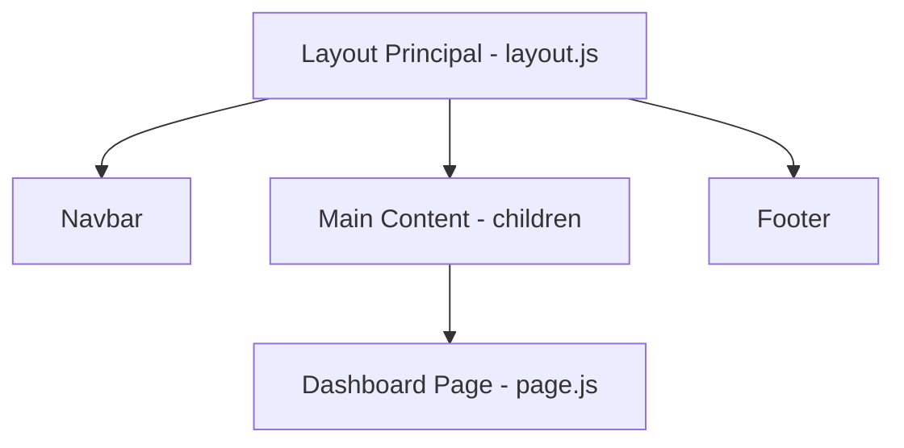

# 🎨 Guide d'Intégration de la Maquette : Tableau de Bord & Structure Commune

Ce document pédagogique détaille les choix techniques, les structures et les styles mis en place pour intégrer la maquette Figma de la première page de notre application : le **Tableau de Bord**, ainsi que ses composants de structure (la **Barre de navigation** et le **Pied de page**).

---

## 1. Structure Globale & Layout

Pour assurer la cohérence visuelle, nous avons structuré la page avec un layout parent (`layout.js`) qui entoure toutes les pages de l'application et gère l'affichage conditionnel de la navigation.



### Le squelette flexible (CSS)
Dans le [layout.js](file:///home/obarthe/Bureau/Formation_Dev_IA/Projet11New/frontend/src/app/layout.js), nous utilisons Flexbox sur le tag `<body>` pour garantir que le Footer reste collé en bas de l'écran, même si le contenu de la page est court :
```javascript
style={{ display: "flex", flexDirection: "column", minHeight: "100vh" }}
```
Le tag `<main>` possède un style `flex: 1` pour occuper tout l'espace disponible restant entre la Navbar et le Footer.

---

## 2. La Barre de Navigation (`Navbar.js`)

La barre de navigation ([Navbar.js](file:///home/obarthe/Bureau/Formation_Dev_IA/Projet11New/frontend/src/components/Navbar.js)) est un élément clé de l'intégration, respectant les spécifications strictes de la maquette Figma.

### A. Affichage Conditionnel
La Navbar ne doit pas être visible sur les pages de connexion (`/`) et d'inscription (`/register`). Pour cela, nous utilisons le hook `usePathname()` :
```javascript
const pathname = usePathname();
if (pathname === "/" || pathname === "/register") return null;
```

### B. États Actifs & Swapping d'Images (Figma Specs)
Afin de respecter la charte graphique Figma où l'onglet actif possède un visuel noir et l'onglet inactif un visuel blanc :
1.  Nous détectons la route active : `const isDashboardActive = pathname === "/dashboard";`
2.  Nous modifions dynamiquement la source de l'image (l'icône) en fonction de cet état :
```javascript

```

### C. Récupération du Profil & Avatar Dynamique
Pour afficher les initiales de l'utilisateur connecté dans le cercle de l'avatar :
1.  **Récupération sécurisée :** Le token est extrait des cookies et envoyé dans les en-têtes (Header `Authorization: Bearer <token>`) de la requête vers `/api/auth/profile`.
2.  **Génération des initiales :** Le prénom et le nom sont séparés par un espace, puis nous prenons la première lettre de chaque mot :
    *   *Exemple :* "Alice Dupont" ➡️ `A` (de Alice) + `D` (de Dupont) = `AD`.
    *   *Exemple :* "Alice" (nom unique) ➡️ Les deux premières lettres `AL`.
3.  **Style Figma de l'avatar :** Défini dans [globals.css](file:///home/obarthe/Bureau/Formation_Dev_IA/Projet11New/frontend/src/app/globals.css) avec un cercle parfait (`border-radius: 50%`), un centrage Flexbox, et une taille stricte de `65px`.

---

## 3. Le Tableau de Bord (`dashboard/page.js`)

Le tableau de bord ([page.js](file:///home/obarthe/Bureau/Formation_Dev_IA/Projet11New/frontend/src/app/dashboard/page.js)) rassemble les tâches assignées de l'utilisateur et gère la logique de déconnexion et de bascule de vue.

### A. Récupération des Tâches
Au chargement de la page (`useEffect`), une requête interroge `/api/dashboard/assigned-tasks`. Les données reçues alimentent l'état local `tasks`. Si le serveur renvoie une erreur d'authentification (401 - Unauthorized), l'application supprime le cookie expiré et redirige instantanément l'utilisateur vers l'accueil.

### B. Système de Bascule (Boutons Toggle)
Pour changer de vue entre la liste et le Kanban :
*   Un état local `view` prend la valeur `"list"` ou `"kanban"`.
*   Les boutons stylisés ajoutent la classe `.active` lorsque la vue correspondante est sélectionnée. Cela modifie leur couleur de fond (`#fff0e6` orange très clair) et de texte (`#ff6b00` orange) conformément aux styles Abricot.

### C. Traduction et Badges de Statut
L'API renvoie des statuts en anglais brut (`TODO`, `IN_PROGRESS`, `DONE`). Pour intégrer les badges colorés de la maquette Figma, nous utilisons une fonction utilitaire `getStatusBadge()` :
*   Elle traduit le texte pour l'utilisateur ("À faire", "En cours", "Terminée").
*   Elle renvoie une classe CSS spécifique associée à une couleur définie dans notre feuille de style globale (`.status-todo`, `.status-in-progress`, `.status-done`).

---

## 4. Intégration de la Charte Graphique (CSS Globaux)

Tous les styles réutilisables et le design system se trouvent dans [globals.css](file:///home/obarthe/Bureau/Formation_Dev_IA/Projet11New/frontend/src/app/globals.css) :

*   **Typographie :** Importation de la police **Inter** via Google Fonts.
*   **Hauteurs fixes :** La Navbar a une hauteur imposée de `94px` avec un alignement vertical parfait pour éviter les sauts de mise en page.
*   **Boutons :** Styles définis pour `.btn-primary` (foncé), `.btn-secondary` (foncé avec moins de padding) et `.btn-danger` (rouge basé sur la variable `--error`).
*   **Cartes de Tâches (`.task-card`) :** Utilisation d'un cadre fin gris clair (`#eee`), de coins arrondis (`8px`) et d'un alignement Flexbox `space-between` pour répartir le texte à gauche et les badges/boutons à droite.

---

## 💡 Concepts clés à retenir pour ta formation

1.  **L'état local partagé :** L'authentification (token cookie) sert à la fois à la `Navbar` pour afficher l'avatar de la bonne personne, et au `Dashboard` pour récupérer ses tâches spécifiques.
2.  **Composants conditionnels :** La méthode `if (pathname === ...) return null` dans un composant est une excellente pratique Next.js pour ne pas encombrer le DOM sur des pages n'ayant pas besoin de navigation.
3.  **Routage SPA (Single Page Application) :** L'usage de `next/link` évite au navigateur de recharger entièrement les scripts React à chaque changement de page, optimisant les performances de l'application.
