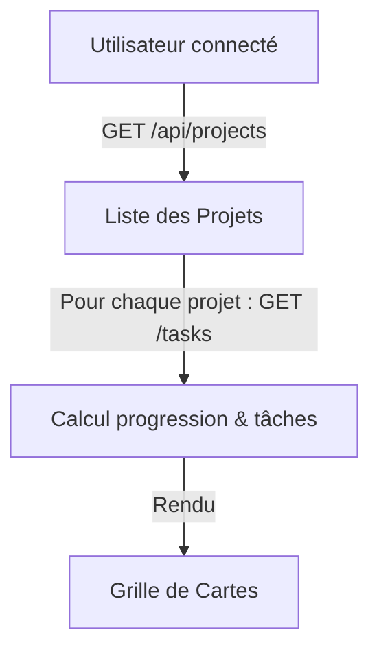

# Intégration des Maquettes : Gestion des Projets et Rôles Utilisateurs

Ce document résume l'intégration de la page de la liste des projets (**Mes projets**) et de la page de détail d'un projet spécifique (**Détail du projet**), en accord avec les maquettes Figma fournies et les exigences fonctionnelles (rôles utilisateurs, authentification, commentaires).

---

## 1. Structure de Navigation et Fichiers

Les deux pages s'intègrent dans l'architecture de routage Next.js (App Router) existante :
*   **Liste des projets :** [projects/page.js](file:///home/obarthe/Bureau/Formation_Dev_IA/Projet11New/frontend/src/app/projects/page.js) (Route : `/projects`)
*   **Détail d'un projet :** [projects/[id]/page.js](file:///home/obarthe/Bureau/Formation_Dev_IA/Projet11New/frontend/src/app/projects/[id]/page.js) (Route : `/projects/:id` dynamique)
*   **Feuille de style unifiée :** Les classes CSS associées à ces deux pages ont été regroupées à la fin du fichier global [globals.css](file:///home/obarthe/Bureau/Formation_Dev_IA/Projet11New/frontend/src/app/globals.css) pour faciliter la maintenance.

---

## 2. Page 1 : Liste des projets (« Mes projets »)

Cette page affiche sous forme de grille responsive tous les projets auxquels l'utilisateur connecté est associé.

### Intégration Visuelle (Figma)
*   **Grille Responsive :** Utilisation de CSS Grid (`.projects-grid`) passant de 3 colonnes sur PC de bureau à 2 colonnes sur tablette, puis 1 seule colonne sur mobile.
*   **Cartes de projet (`.project-card`) :** Style blanc épuré avec angles arrondis (`12px`), bordure fine, et effet de survol dynamique (la carte s'élève de `4px` avec une ombre portée diffuse).
*   **Barre de progression :**
    *   Fond gris clair (`.project-progress-bar-bg`).
    *   Remplissage orange Abricot (`.project-progress-bar-fill`) calculé en pourcentage de tâches ayant le statut `DONE`.
*   **Avatars d'Équipe :** 
    *   Affichage en premier du propriétaire (avatar initiales avec un badge orange clair `Propriétaire`).
    *   Affichage des autres contributeurs (initiales dans des cercles grisés).
    *   Les couleurs des avatars sont générées de façon déterministe et stable à partir du nom ou de l'email de l'utilisateur pour une interface harmonieuse.

### Logique Fonctionnelle et Rôles
*   **Calcul de la progression (Côté Client) :** Afin de ne pas modifier le backend, la page effectue des appels parallèles à `GET /api/projects/:id/tasks` pour extraire et compter les tâches `DONE` par rapport au total.
*   **Gestion des Rôles (Actions rapides) :**
    *   Le système vérifie si l'utilisateur connecté est le créateur du projet (`project.ownerId === currentUserId`) ou possède un rôle administratif (`project.userRole === "ADMIN"`).
    *   Si oui, des **boutons d'action rapide (Crayon d'édition et Poubelle de suppression)** apparaissent au survol de la carte.
    *   Si non (simple contributeur), ces boutons sont invisibles.
    *   L'action de suppression est reliée à `DELETE /api/projects/:id` (avec boîte de confirmation standard).

---

## 3. Page 2 : Détail du projet

Cette page offre une vision complète des tâches d'un projet, de l'équipe et permet de collaborer via les commentaires de tâches.

### Intégration Visuelle
*   **Bouton de retour :** Un bouton carré blanc contenant l'icône `ArrowLeft` permet de revenir instantanément à `/projects`.
*   **En-tête de page :** Le titre du projet est suivi de la description. Si l'utilisateur est administrateur, un lien **"Modifier"** orange s'affiche à côté du titre.
*   **Barre des Contributeurs (`.contributors-bar`) :** 
    *   Un bandeau gris horizontal reprenant le nombre de contributeurs.
    *   Chaque membre est affiché sous forme d'une capsule contenant son avatar (cercle avec initiales) et son nom complet (ou `Propriétaire` pour le propriétaire).
*   **Cartes de Tâches (`.task-card`) :** 
    *   Présentation verticale des tâches. Le statut de chaque tâche est mis en valeur par des couleurs adaptées (`À faire` ➡️ rouge clair, `En cours` ➡️ jaune/orange clair, `Terminée` ➡️ vert clair).
    *   Les assignés à la tâche sont affichés sous forme de mini-capsules (`Avatar + Nom`).

### Interactivité et Commentaires
*   **Commentaires rétractables :** Chaque carte de tâche possède un accordéon "Commentaires (N)". Au clic, il se déploie pour afficher la liste des commentaires (auteur, date, texte).
*   **Ajout de commentaire en direct :** Un champ de texte avec une icône de soumission (`Send`) permet de rédiger un commentaire.
    *   La validation appelle l'API `POST /api/projects/:id/tasks/:taskId/comments`.
    *   Pendant l'envoi, un indicateur de chargement rotatif (`Loader2`) est affiché.
    *   Une fois soumis, le champ se vide et la liste des tâches est rafraîchie en arrière-plan pour afficher le nouveau commentaire instantanément.

---

## 4. Bilan des API Backend exploitées

Le frontend communique de manière transparente avec le backend à travers le middleware proxy :
*   `GET /api/auth/profile` : Identification de l'utilisateur connecté (pour déterminer ses droits d'administration sur les projets).
*   `GET /api/projects` : Récupération de l'ensemble des projets autorisés pour l'utilisateur.
*   `GET /api/projects/:id` : Récupération des détails d'un projet spécifique.
*   `DELETE /api/projects/:id` : Suppression du projet (réservé aux admins).
*   `GET /api/projects/:id/tasks` : Récupération de toutes les tâches associées, incluant les assignés et commentaires.
*   `POST /api/projects/:id/tasks/:taskId/comments` : Publication d'un nouveau commentaire sur une tâche spécifique.
